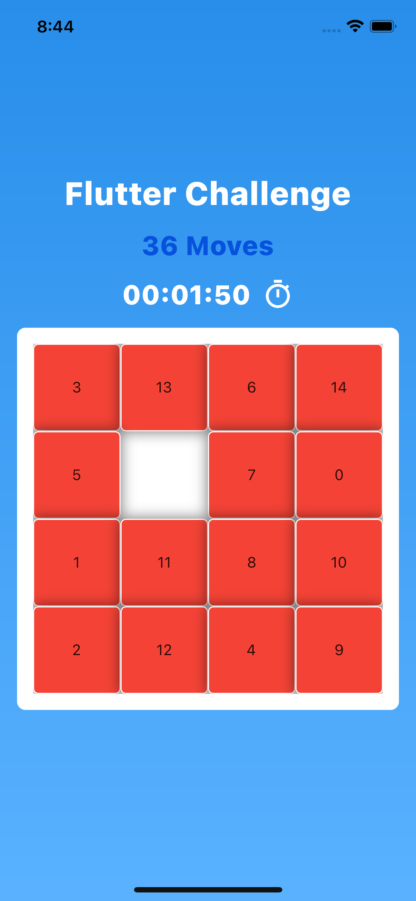

# Flutter_Challenge
Un juego de puzzle en donde debes encontrar el orden correcto de los números

## Instalación

Ejecutar el siguiente comando en la raiz del proyecto para instalar las dependencias
### `flutter packages get`

## Levantar la aplicacion

Seleccione un dispositivo movil y levante la aplicación

### `F5`

## Imagenes de la aplicacion

   

